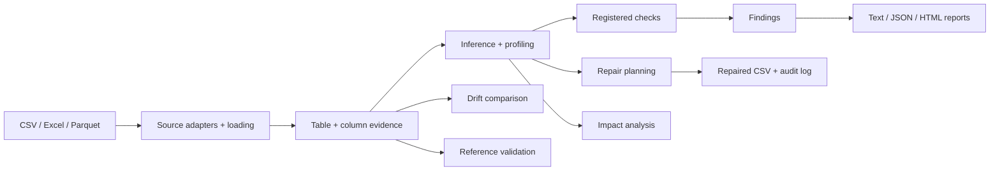
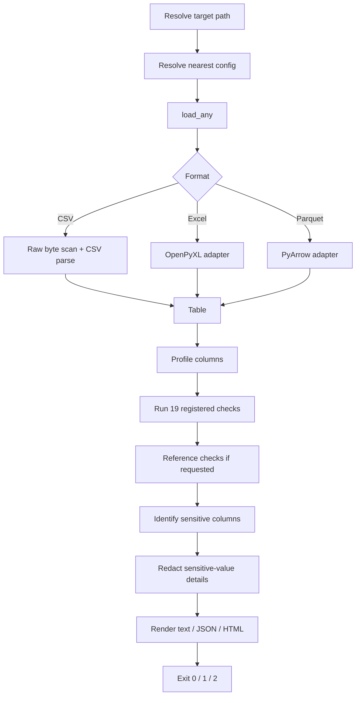
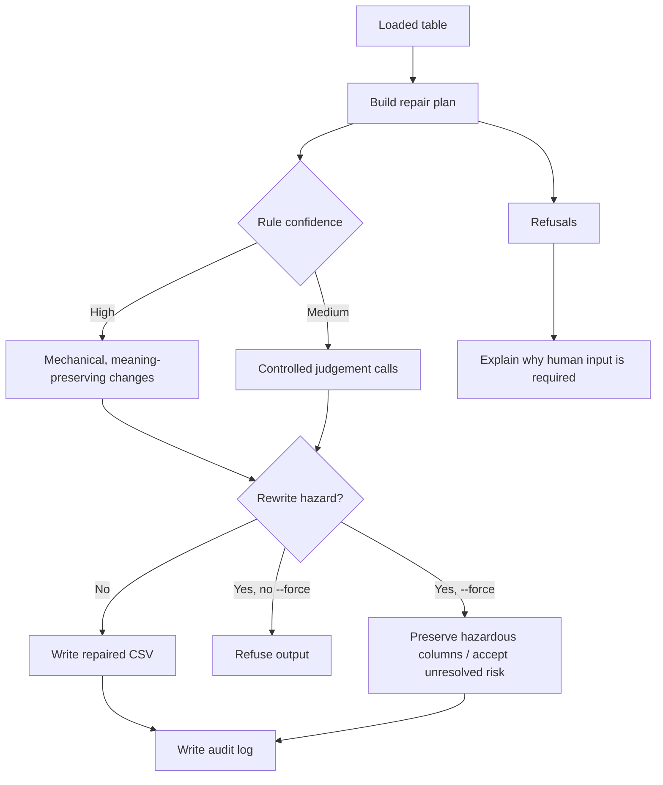
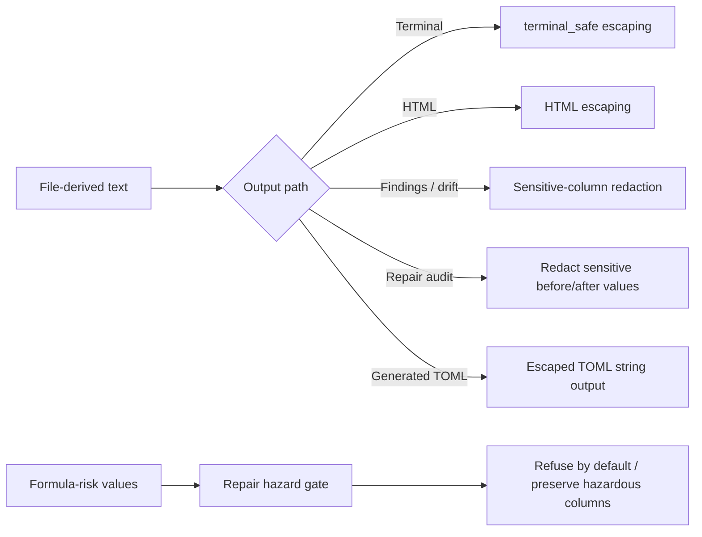
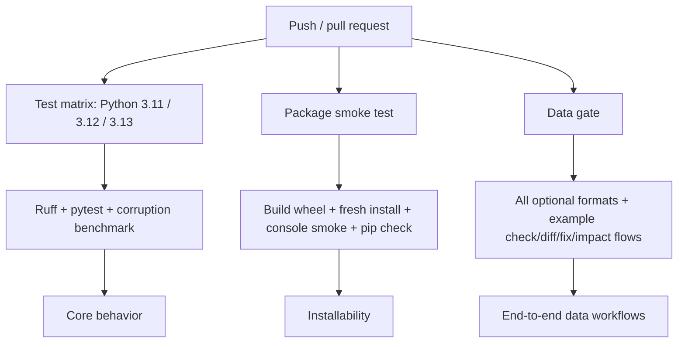

# Sift - Architecture, Design, Testing & Operations Guide

> **Documentation baseline**  
> Sift `0.1.0`, package name `sift-csv`, CLI command `sift`.  
> Prepared against the verified Sift `0.1.0` source tree. The public guide is versioned with the repository so documentation changes can be reviewed alongside code changes.

Sift is a Python linter for tabular data files. Its focus is not whether a file can be opened, but whether the file contains values or structure that can silently change downstream results after a successful load. CSV is the dependency-free core path; Excel and Parquet are optional formats.

This guide documents the architecture, command-line behavior, source modules, design decisions, safety properties, testing strategy, performance choices, extension points, and operational expectations of the definitive project state.

**Repository navigation:** [README](../README.md) · [finding codes](../CODES.md) · [benchmark](../BENCHMARK.md) · [real-data notes](../REAL-DATA.md) · [setup](../SETUP.md) · [tests](../tests/test_sift.py) · [CI workflow](../.github/workflows/ci.yml)

## Contents

- [1. Project purpose](#1-project-purpose)
- [2. Verified baseline](#2-verified-baseline)
- [3. Architecture at a glance](#3-architecture-at-a-glance)
- [4. Repository structure](#4-repository-structure)
- [5. Core data model](#5-core-data-model)
- [6. End-to-end processing flow](#6-end-to-end-processing-flow)
- [7. Source loading](#7-source-loading)
- [8. Inference and profiling](#8-inference-and-profiling)
- [9. Checks and findings](#9-checks-and-findings)
- [10. Configuration](#10-configuration)
- [11. Command-line interface](#11-command-line-interface)
- [12. Reporting](#12-reporting)
- [13. Safe repair](#13-safe-repair)
- [14. Drift analysis](#14-drift-analysis)
- [15. Impact analysis](#15-impact-analysis)
- [16. Cross-file references](#16-cross-file-references)
- [17. Baseline-derived configuration](#17-baseline-derived-configuration)
- [18. Security and safety](#18-security-and-safety)
- [19. Performance design](#19-performance-design)
- [20. Testing strategy](#20-testing-strategy)
- [21. Benchmark and real-data evidence](#21-benchmark-and-real-data-evidence)
- [22. Packaging and CI](#22-packaging-and-ci)
- [23. Public library API](#23-public-library-api)
- [24. Change-impact guide](#24-change-impact-guide)
- [25. Extending Sift safely](#25-extending-sift-safely)
- [26. Troubleshooting](#26-troubleshooting)
- [27. Known limitations](#27-known-limitations)
- [28. Operational checklist](#28-operational-checklist)
- [29. Design decisions and trade-offs](#29-design-decisions-and-trade-offs)
- [30. Glossary](#30-glossary)

---

## 1. Project purpose

Sift is built around one question:

> **What can be wrong with a tabular file even when the file loads successfully?**

A conventional parser answers whether bytes can be decoded and rows can be read. Sift continues past that point. It looks for evidence that a reader, spreadsheet, dataframe library, join, group-by, or aggregate may silently interpret the data in a damaging way.

Examples include:

- dates that can be interpreted in more than one order;
- numbers written with currency symbols or locale-specific separators;
- numeric sentinel values such as `-999` that enter an average as real data;
- category labels split by casing or whitespace;
- duplicate keys that multiply rows in a join;
- spreadsheet-formula-risk values;
- sensitive values that should not be echoed into logs or reports;
- cross-file references that disappear in joins;
- schema or distribution changes between a known-good baseline and a current file.

Sift is deliberately conservative about repair. It changes values only when the change is derivable from the file itself. When the evidence is insufficient, it records a refusal instead of inventing an answer.

### What Sift is not

Sift is not a database, schema registry, dataframe engine, ETL orchestrator, web service, or warehouse-scale profiler. It has no database, authentication layer, HTTP API, queue, or frontend. Its primary interfaces are a local CLI and a small Python library API.

---

## 2. Verified baseline

The definitive project state has the following properties:

| Property | Definitive state |
|---|---|
| Project version | `0.1.0` |
| Distribution name | `sift-csv` |
| CLI | `sift` |
| Python requirement | `>=3.11` |
| Mandatory runtime dependencies | None |
| Excel extra | `openpyxl>=3.1` |
| Parquet extra | `pyarrow>=14.0` |
| Build backend | Hatchling |
| License | MIT |
| Python source modules | 16 |
| Registered check functions | 19 |
| Stable documented finding codes | 63 |
| CLI subcommands | 6 |
| Local verification | 219 passed, 1 skipped |
| Known-corruption benchmark | 28/28 detected |
| Clean-control benchmark noise | 0 findings |

The one skipped local test is the optional PyArrow integration when PyArrow is unavailable in the local verification environment. The committed CI configuration installs the development extras and is designed to run the suite on Python 3.11, 3.12, and 3.13.

The benchmark result is evidence about the 28 planted corruption cases in `bench/`; it is **not** a claim that Sift detects every possible data-quality defect.

---

## 3. Architecture at a glance

Sift keeps the pipeline explicit: loading produces a `Table`; profiling and inference attach evidence to columns; checks produce `Finding` objects; output paths render, compare, quantify, or repair that evidence.



The branch points matter: findings feed reporting, while repair and impact operate from the loaded/profiled data rather than from rendered finding text. Drift and reference validation are sibling analyses built on the same common table model.

The architecture is intentionally module-oriented rather than framework-oriented. Each source file owns one clear concern:

| Module | Responsibility |
|---|---|
| [`sift/__init__.py`](../sift/__init__.py) | Small public library API: `lint`, `diff`, public types, version |
| [`sift/loading.py`](../sift/loading.py) | CSV byte diagnostics, delimiter handling, row ingestion, `Table`/`Column` |
| [`sift/sources.py`](../sift/sources.py) | Excel/Parquet adapters and source discovery/dispatch |
| [`sift/inference.py`](../sift/inference.py) | Value-level number/date/null/boolean/text evidence |
| [`sift/profiling.py`](../sift/profiling.py) | Column summaries and date/number convention inference |
| [`sift/checks.py`](../sift/checks.py) | Registered data-quality checks and finding collapse |
| [`sift/findings.py`](../sift/findings.py) | `Severity`, `Finding`, sorting and sensitive-column redaction |
| [`sift/config.py`](../sift/config.py) | `sift.toml` discovery, validation, thresholds and silencing |
| [`sift/reporting.py`](../sift/reporting.py) | Text, JSON and HTML rendering |
| [`sift/repair.py`](../sift/repair.py) | Repair planning, refusals, CSV writing and audit logs |
| [`sift/drift.py`](../sift/drift.py) | Baseline-versus-current comparison |
| [`sift/impact.py`](../sift/impact.py) | Aggregate blast-radius calculations |
| [`sift/references.py`](../sift/references.py) | Explicit cross-file referential-integrity checks |
| [`sift/initialize.py`](../sift/initialize.py) | Generate a reviewed config from a trusted baseline |
| [`sift/text.py`](../sift/text.py) | Shared human-readable formatting and terminal safety |
| [`sift/cli.py`](../sift/cli.py) | Argument parsing, command dispatch, exit codes and orchestration |

---

## 4. Repository structure

```text
sift/
├── .github/
│   ├── ISSUE_TEMPLATE/
│   │   └── bug_report.md
│   └── workflows/
│       ├── README.md
│       └── ci.yml
├── bench/
│   ├── __init__.py
│   ├── corruptions.py
│   └── run.py
├── demo/
│   ├── README.md
│   ├── demo.tape
│   └── orders.csv
├── docs/
│   └── PROJECT_GUIDE.md
├── examples/
│   ├── customers.csv
│   ├── orders.parquet
│   ├── orders.xlsx
│   ├── orders_baseline.csv
│   ├── orders_de.csv
│   ├── orders_messy.csv
│   └── orders_with_refs.csv
├── sift/
│   └── ...16 Python modules...
├── tests/
│   └── test_sift.py
├── .gitattributes
├── .gitignore
├── BENCHMARK.md
├── CODES.md
├── LICENSE
├── README.md
├── REAL-DATA.md
├── SETUP.md
├── pyproject.toml
├── sample-report.html
└── sift.toml
```

### Why the repository-level files exist

- **[`pyproject.toml`](../pyproject.toml)** defines packaging, optional extras, the `sift` console entry point, pytest settings, and Ruff rules.
- **[`sift.toml`](../sift.toml)** is the documented default runtime configuration example.
- **[`.gitignore`](../.gitignore)** excludes generated Python, coverage, build, environment, and tool-cache files from version control.
- **[`.gitattributes`](../.gitattributes)** prevents Git from normalizing the deliberately corrupted line endings in `examples/orders_messy.csv`.
- **[`CODES.md`](../CODES.md)** documents the stable finding-code interface.
- **[`BENCHMARK.md`](../BENCHMARK.md)** records the controlled corruption benchmark.
- **[`REAL-DATA.md`](../REAL-DATA.md)** records results and false-positive fixes from public datasets.
- **[`SETUP.md`](../SETUP.md)** documents repository publication and CI setup.
- **[`sample-report.html`](../sample-report.html)** demonstrates the standalone HTML renderer.
- **[`bench/`](../bench/)** measures recall on planted corruptions and silence on a clean control.
- **[`examples/`](../examples/)** provides fixtures for CSV, Excel, Parquet, references, locale-number handling, drift, and repair demonstrations.
- **[`demo/`](../demo/)** contains an optional terminal recording script.
- **[`docs/PROJECT_GUIDE.md`](PROJECT_GUIDE.md)** is this deeper architecture/operations reference; the README remains the concise entry point.

---

## 5. Core data model

### `Table`

`loading.Table` is the central in-memory representation. It records:

- source `path`;
- raw `header` names;
- profiled `columns`;
- row count (`n_rows`);
- detected delimiter;
- file-level findings discovered before ordinary column checks.

### `Column`

Each `Column` records:

- original zero-based index;
- original name;
- lookup key;
- retained string values;
- a `ColumnProfile`.

### `ColumnProfile`

Profiling turns raw strings into evidence rather than immediately coercing them to a dataframe dtype. The profile contains the observed kind, null rate, cardinality and the evidence required by checks and repair decisions.

### `Finding`

A finding is the unit of public output:

```text
code      stable machine-readable identifier
severity  error / warning / info
column    optional affected column
message   human-oriented consequence
examples  bounded sample values when safe
 detail    structured supporting metadata
```

The code is intentionally stable because it appears in JSON and is also the identifier used by configuration to silence a rule.

### Severity ordering

`error > warning > info`. The ordering is used by sorting, CLI failure thresholds, and reporting.

---

## 6. End-to-end processing flow

The normal `sift check` path is:



A critical implementation detail is configuration resolution for multi-file checks: unless the user explicitly supplies `--config` or `--no-config`, each target resolves its own nearest `sift.toml`. This avoids applying one file's local policy to unrelated files in another directory.

---

## 7. Source loading

### 7.1 CSV path

CSV uses only the Python standard library.

Before parsing rows, `loading._scan_bytes()` performs file-level diagnostics that a normal dataframe import may erase:

- UTF-8 validity;
- UTF-8 BOM;
- NUL bytes;
- CRLF/LF mixing;
- missing final newline.

The byte scan reads **64 KiB chunks** instead of loading a second full copy of the file. UTF-8 is validated with an incremental decoder so a multibyte character split across chunk boundaries is handled correctly.

The parser raises Python's CSV field-size ceiling to a bounded 16 MiB field limit. This accommodates real long-text/embedded-data fields without making field size unbounded.

Delimiter inference uses `csv.Sniffer` over the supported delimiter set `, ; tab |`. If the sniffer cannot decide, a single-column file safely defaults to comma rather than being rejected.

### 7.2 `--max-rows`

Positive `max_rows` values bound row ingestion. Zero and negative values are rejected consistently. The raw byte scan still inspects file-level byte evidence, while retained rows and profiles are limited to the requested amount.

### 7.3 Excel

Excel support is provided through the optional OpenPyXL dependency. Sift reads one worksheet at a time and reports unexamined sheets. Excel-specific checks include:

- preamble rows above a detected header;
- partial Excel date typing;
- broken formula results;
- unread sheets.

A single-column worksheet is treated as valid data rather than being mistaken for a human-readable preamble.

### 7.4 Parquet

Parquet support uses optional PyArrow. Because Parquet has an explicit schema, Sift treats that schema as deliberate metadata and checks whether observed values still fit it. A representative finding is `loose-schema` when a string-declared column is semantically numeric.

### 7.5 Source discovery

`sources.discover()` allows `sift check` to accept explicit files or directories. Directory checks discover supported formats and then process each target.

---

## 8. Inference and profiling

Sift's inference layer is evidence-based. It avoids treating a single parser success as proof of semantic intent.

### Number evidence

The number parser considers English and European separator conventions. Important outcomes include:

- ordinary numeric values;
- currency/thousands formatting;
- European decimal notation;
- conflicting conventions;
- separator forms that remain undecidable.

This distinction is important because `1.234` may represent roughly one point two or one thousand two hundred thirty-four depending on convention, while `1.234,56` provides stronger locale evidence.

### Date evidence

Date parsing distinguishes:

- ISO/unambiguous dates;
- day-first evidence;
- month-first evidence;
- weak evidence;
- complete ambiguity;
- explicit conflict where different rows prove incompatible interpretations.

Eight-digit values receive special handling. A compact value such as `20240115` can be a date, while a large ordinary number may accidentally match a date format. Guards prevent arbitrary eight-digit numerics from being treated as dates unless the column contains additional date evidence.

### Profiling decisions

Profiles track enough evidence for later checks to decide whether a column is numeric, date-like, categorical, empty, mixed, or otherwise semantically interesting. Statistics are deliberately skipped when a column has already failed type consistency; computing a median over only the numeric subset of a mixed-type column would describe a subset the author may never have intended.

---

## 9. Checks and findings

Sift has **19 registered check functions** and **63 stable documented finding codes**.

The codes are grouped in [`CODES.md`](../CODES.md) as follows:

| Category | Codes |
|---|---:|
| Structure | 11 |
| Types and numbers | 10 |
| Dates | 7 |
| Missing data | 4 |
| Values | 6 |
| Keys and references | 8 |
| Sensitive data | 2 |
| Excel and Parquet | 5 |
| Drift (`sift diff`) | 10 |
| **Total** | **63** |

### Registered check functions

The check registry covers:

1. header problems;
2. files with headers but no data rows;
3. missing data;
4. empty/constant columns;
5. duplicate rows;
6. declared/candidate keys;
7. mixed types;
8. numeric formatting;
9. decimal convention;
10. leading zeros;
11. whitespace;
12. label variants and near-duplicates;
13. date problems;
14. numeric value problems/outliers;
15. compact date-or-number ambiguity;
16. cardinality;
17. spreadsheet-formula risk;
18. sensitive data;
19. encoding/mojibake-style value problems.

### Finding collapse

Repeated low-severity findings can be collapsed for readability, while errors are kept explicit. The goal is to reduce report noise without hiding severe problems.

### Configuration filtering

After findings are generated, configuration can silence them globally by code or only for named columns. Per-column silencing is preferred because it preserves the same signal where it may matter elsewhere.

---

## 10. Configuration

Sift reads `sift.toml` or `.sift.toml`. If a config path is not supplied explicitly, it walks upward from the file being checked and uses the nearest config.

Default configuration:

```toml
[sift]
null_warn = 0.10
null_error = 0.50
outlier_z = 6.0
outlier_share = 0.05
max_examples = 3
key = []
fail_on = "error"
ignore = []

[sift.ignore_columns]
```

### Validation rules

Configuration is intentionally strict. Invalid TOML or semantically invalid settings produce a `ConfigError` rather than silently falling back to defaults. Examples include:

- ratios outside `0..1`;
- `null_warn > null_error`;
- non-positive `outlier_z`;
- negative/non-integer `max_examples`;
- unsupported `fail_on` values;
- malformed list/table settings.

This follows an important rule: configuration is a statement of intent. A typo should not quietly disable the policy the user thought they enabled.

### Failure thresholds

`fail_on` can be:

- `error`;
- `warning`;
- `info`;
- `none`.

CLI `--fail-on` overrides the config for that invocation.

---

## 11. Command-line interface

Sift exposes six subcommands.

### `sift check`

Purpose: lint one file, several files, or supported files discovered in a directory.

Important options:

- `--sheet SHEET`
- `--references FILE:LOCAL=FOREIGN`
- `--key COLUMN`
- `--delimiter`
- `--config` / `--no-config`
- `--format text|json|html`
- `--output`
- `--fail-on error|warning|info|none`
- `--ignore CODE`
- `--max-rows N`

### `sift diff BASELINE CURRENT`

Purpose: compare a current file against a known-good baseline. Detects schema, type, null-rate, category, distribution and row-count changes.

### `sift fix FILE`

Purpose: plan and optionally write conservative repairs.

Important options:

- `--output`
- `--log`
- `--min-confidence high|medium`
- `--drop-duplicates`
- `--dry-run`
- `--force`
- source/config options.

### `sift impact FILE`

Purpose: quantify how data defects change a concrete aggregate.

Metrics:

- `--sum COLUMN`
- `--group-by COLUMN`

These can be combined.

### `sift init FILE`

Purpose: derive a reviewed `sift.toml` from a trusted baseline file.

Important options:

- `--output`
- `--key`
- `--force`
- `--dry-run`
- source options.

### `sift profile FILE`

Purpose: describe the table and columns without judging them.

### Exit codes

| Code | Meaning |
|---:|---|
| `0` | No finding met the configured failure threshold |
| `1` | At least one finding met the threshold |
| `2` | The input/config/command could not be processed as requested |

Exit code `2` is intentionally different from `1`: a broken pipeline must not look like a clean file.

---

## 12. Reporting

Sift has three report formats.

### Text

Human-oriented terminal output. Paths, column names and sample values are passed through terminal-safety escaping before they are embedded in trusted report formatting.

### JSON

Machine-oriented output. `Finding.to_dict()` preserves the stable code, severity, column, message, details and safe examples.

### HTML

Standalone shareable report. Hostile values are HTML-escaped before rendering.

### Output collision protection

The CLI guards against report/repair destinations that would overwrite the input file accidentally.

---

## 13. Safe repair

Repair is deliberately separated into **planning** and **writing**.



### Repair rules

The repair layer includes rules for:

- trimming whitespace;
- collapsing repeated internal spaces;
- converting disguised blank/null tokens;
- normalizing safely interpretable number formatting;
- converting dates to ISO only when the column proves the interpretation;
- canonicalizing category labels;
- removing repeated numeric sentinels when configured/evidenced;
- optionally dropping exact duplicate rows.

### Refusal is a first-class result

Sift refuses cases that cannot be derived from the file itself, such as:

- conflicting date formats;
- unresolved mixed types;
- mojibake where original bytes are gone;
- rewrite hazards such as ragged rows;
- spreadsheet-formula-risk content.

### Text-preserving numeric repair

Number edits are performed as text, not by round-tripping the file through `float()`. Parsing verifies the semantic number while textual editing preserves the file's intended precision and avoids unnecessary formatting changes.

### Audit log

When `--log` is requested, each changed cell records the location, before value, after value and rule. Sensitive columns redact before/after values in the audit output.

### Idempotency

The test suite verifies that applying the repair a second time makes no further changes.

---

## 14. Drift analysis

`sift diff` compares two tables rather than re-running only ordinary single-file checks.

The documented drift codes cover:

- removed columns;
- added columns;
- reordered columns;
- type changes;
- null-rate increases;
- median/distribution shifts;
- new categories;
- vanished categories;
- large row-count changes.

Sensitive category examples are redacted before public diff output.

A baseline file can therefore act as a regression contract for the shape and statistical behavior of recurring data.

---

## 15. Impact analysis

A finding says what is wrong. `sift impact` asks what the defect does to a number a user cares about.

For a sum, Sift can compare:

- what a naive/coercing load effectively keeps;
- the coerced aggregate;
- the aggregate after safe repairs;
- the difference;
- a decomposition of causes.

For grouping, it can show how label variants create extra groups and how much value sits under those unintended spellings.

For duplicate rows, it can quantify aggregate inflation.

The implementation reuses one prepared repair snapshot across requested metrics rather than rebuilding it for each calculation.

---

## 16. Cross-file references

References are explicit rather than inferred from a schema language.

Syntax:

```text
--references customers.csv:customer_id=id
```

Interpretation:

> The current file's `customer_id` values must exist in `customers.csv` column `id`.

Reference checks can report:

- missing referenced rows (`orphaned-reference`);
- repeated foreign-side keys (`reference-not-unique`);
- null local references (`reference-null`);
- keys that match only after case/spacing cleanup (`reference-matches-after-cleaning`).

Within one `check` command, repeatedly used reference files are cached so they are not loaded again for every relationship/target.

---

## 17. Baseline-derived configuration

`sift init` learns the policy from a file the user already trusts.

The design distinction is:

- **shape findings** may be accepted as normal and converted to explicit config exemptions;
- **damage findings** are refused and should be fixed before the file becomes the definition of normal.

Generated config includes comments explaining why exemptions exist. The resulting file is text suitable for review in version control.

Generated TOML string values are escaped using JSON-compatible string escaping. This keeps control characters out of generated config text while preserving the exact logical column name when TOML is read again.

---

## 18. Security and safety

Security in Sift is mostly about treating data-derived text as untrusted even though the program is a local CLI.



The controls are intentionally placed at output or rewrite boundaries. Ordinary source values stay available internally for analysis, while untrusted values are escaped, redacted, or blocked before they can become unsafe public output.

### 18.1 Terminal control characters

`terminal_safe()` makes C0/C1 terminal controls visible instead of sending them as control sequences. Newlines, tabs and carriage returns inside untrusted fields become visible escapes.

It also makes Unicode bidirectional formatting controls visible. These characters can change how a terminal line appears without changing the underlying bytes, so displaying an explicit `\u....` form is safer than letting them alter display order.

Ordinary Unicode is kept intact.

### 18.2 Sensitive-data redaction

The sensitive-data detector itself does not emit raw examples. More importantly, redaction is applied at the **column level**, not only to the sensitive finding.

If a column appears sensitive, another unrelated finding on that column is not allowed to leak a raw source value through its examples, message or free-form detail. Safe numeric metadata can remain.

This property also reaches repair audit logs and public drift output.

### 18.3 Spreadsheet-formula risk

Values beginning with spreadsheet-executable prefixes such as `=`, `+` or `@` are detected. Repair does not rewrite those columns as if the data were ordinary text.

By default, `sift fix` refuses to write an output while unresolved rewrite hazards remain. `--dry-run` previews the refusal. `--force` is an explicit acceptance of the unresolved risk and hazardous columns remain preserved rather than silently transformed.

### 18.4 HTML escaping

The HTML renderer escapes untrusted values before embedding them in the standalone report.

### 18.5 Configuration fail-closed behavior

Malformed config is rejected instead of silently replaced with defaults. This protects the user's intended lint policy.

### 18.6 CI security posture

The committed workflow:

- grants read-only repository-content permissions;
- disables persisted checkout credentials;
- pins GitHub Actions to immutable commit SHAs.

---

## 19. Performance design

Sift prioritizes correctness and evidence over maximum throughput, but several concrete optimizations keep typical files practical.

### Streaming raw byte scan

Raw byte diagnostics read 64 KiB chunks rather than duplicating the entire file in memory. Incremental UTF-8 decoding preserves correctness across chunk boundaries.

### Date parsing prefilter and memoization

Real-data profiling showed date parsing to be a major bottleneck. Cheap shape checks reject values that cannot match a date before `strptime` work begins, and repeated values are memoized.

The repository's real-data notes record an 18 MB, 126,000-row case dropping from roughly 239 seconds to 28 seconds after these parsing optimizations, with unchanged results.

### Bounded parsing

`--max-rows` stops row ingestion after the requested positive limit. Excel worksheet iteration and Parquet reads are likewise bounded rather than reading the entire source and slicing afterward.

### Repair snapshot reuse

Impact calculations prepare the repaired rows once and reuse the snapshot across requested metrics.

### Reference cache

Cross-file reference tables are cached within one CLI check command.

### Memory trade-off

The design intentionally retains values as Python strings so it can reason about exactly what the source contained before typed coercion. That costs memory compared with compact typed arrays.

---

## 20. Testing strategy

The definitive suite contains **220 collected tests in the local verification environment: 219 passed and 1 optional PyArrow integration test was skipped**.

The test file covers much more than happy-path unit tests. Major categories include:

- number/date inference;
- clean-file silence;
- every principal check family;
- configuration validation and scoping;
- CLI exit codes and report formats;
- repair plans, refusals, audit logging and idempotency;
- impact-accounting identities;
- real-data regressions and false-positive fixes;
- Excel/Parquet behavior;
- row-bounding behavior;
- cross-file references;
- generated configuration;
- public API format dispatch;
- documentation/code synchronization;
- packaging/CI expectations;
- raw-byte streaming edge cases;
- output escaping and sensitive-data redaction;
- CLI handler dispatch;
- drift behavior;
- coverage that every finding code has a test or benchmark case.

### Documentation as a tested interface

The suite checks that:

- all source finding codes appear in [`CODES.md`](../CODES.md);
- [`CODES.md`](../CODES.md) has no phantom codes;
- all subcommands are documented in the README;
- the README's finding count matches the code documentation;
- the quick-start summary matches the real example fixture;
- CI workflow documentation matches the committed commands;
- benchmark Markdown matches its generator;
- cross-file references remain documented;
- Python classifiers cover the CI version matrix.

That turns documentation drift into a failing test rather than a manual cleanup task.

---

## 21. Benchmark and real-data evidence

### Controlled benchmark

`python -m bench.run` creates a clean control and then applies one known corruption at a time.

Definitive result:

```text
Recall: 28/28 (100%) of known corruptions detected.
Noise:  0 findings on the clean control file.
```

The benchmark measures two things:

- **recall on planted cases** - whether each known corruption triggers the expected finding;
- **noise on the clean control** - whether the same checker invents findings where none were planted.

It does not measure every possible false negative in the world.

### Real-data rounds

[`REAL-DATA.md`](../REAL-DATA.md) records multiple rounds against public datasets. The important engineering value is not the raw count of findings; it is the set of false positives and performance problems those runs exposed and then converted into regression tests.

Examples documented by the project include:

- near-duplicate category logic that was too eager;
- outlier statistics over mixed-type columns;
- skewed distributions misclassified as outliers;
- large eight-digit numbers misclassified as dates;
- a legitimate person named `Nan` being confused with a null token;
- date parsing that dominated runtime on a large dataset.

The resulting fixes made Sift quieter and more precise rather than simply increasing the number of warnings.

---

## 22. Packaging and CI

### Packaging

`pyproject.toml` uses Hatchling and keeps the version in one source of truth: `sift/__init__.py`.

Core installation has no required dependencies:

```bash
pip install -e .
```

Optional formats:

```bash
pip install 'sift-csv[excel]'
pip install 'sift-csv[parquet]'
pip install 'sift-csv[all]'
```

Development extras include pytest, Ruff and both optional format dependencies.

### CI jobs

The GitHub Actions workflow has three main jobs, each proving a different property.



#### Test matrix

Python 3.11, 3.12 and 3.13:

```text
install .[dev]
ruff check .
pytest -q
python -m bench.run
```

#### Package smoke test

The package job builds a wheel, installs it into a fresh virtual environment, imports `sift`, exercises the console script, runs a real `sift check`, and runs `pip check`.

#### Data gate

The data-gate job installs all optional format support and exercises the project as a user would:

- check the example directory;
- compare messy data with the baseline;
- preview safe repair;
- report aggregate impact.

---

## 23. Public library API

The supported top-level API is intentionally small:

```python
from sift import Config, Finding, Severity, diff, lint
```

### `lint(path, config=None, **kwargs)`

Loads a supported source through the same dispatch path as the CLI and returns findings.

Useful source keyword arguments include:

- `delimiter`
- `sheet`
- positive `max_rows`

### `diff(baseline, current, config=None, **kwargs)`

Loads both sources through common dispatch, compares them, and applies sensitive-column redaction to the result.

The API is small by design so callers do not need to depend on internal module structure.

---

## 24. Change-impact guide

When modifying one area, review the neighboring contracts below.

| If you change... | Also inspect / test... |
|---|---|
| A finding code | [`CODES.md`](../CODES.md), config silencing, JSON consumers, tests/benchmark |
| Severity | CLI failure behavior, sort order, examples/docs |
| A check | clean controls, false positives, [`CODES.md`](../CODES.md), benchmark corruption |
| Inference | profiling, checks, repair, impact, real-data regression tests |
| Loading | source adapters, raw-byte diagnostics, `max_rows`, CLI/API tests |
| Excel/Parquet behavior | optional dependencies, source dispatch, CI data gate |
| Repair rule | refusals, audit log, idempotency, sensitive redaction, impact |
| Config key | `config.py`, `sift.toml`, `init`, CLI override behavior, docs |
| CLI option | parser, handler, tests, README/guide |
| Reporting | terminal/HTML safety, JSON contract, output collision behavior |
| Sensitive-data logic | all renderers, repair log, drift, unrelated finding examples |
| Reference behavior | caching, path resolution, null/duplicate/orphan tests |
| Drift rule | baseline tests, sensitive category redaction |
| Package metadata | version source, CI Python matrix, wheel smoke test |
| Example fixture | benchmark/docs tests and `.gitattributes` if corruption is intentional |

---

## 25. Extending Sift safely

### Adding a new check

A safe sequence is:

1. Define the finding behavior and consequence clearly.
2. Add the registered check in `checks.py`.
3. Add its stable code to [`CODES.md`](../CODES.md).
4. Add a positive broken-data test.
5. Add a clean-data/false-positive test.
6. Add a benchmark corruption when the problem is appropriate for the controlled benchmark.
7. Run the check against representative real files.
8. Update the public documentation only after behavior is stable.

The project explicitly values **not firing on correct data** over maximizing warning count.

### Adding a source format

Prefer adapting the source into the existing `Table`/`ColumnProfile` contract instead of building a second checking stack. Source-specific evidence can be represented as file findings while common semantic checks remain shared.

### Adding a repair

A repair should be derivable from the source and meaning-preserving. If the rule needs outside business knowledge, it should normally become a refusal, configuration choice, or explicit user input rather than an automatic edit.

### Adding config

New configuration should be validated strictly and should have a clear relationship to a check or policy. Avoid silent fallback when an invalid value would weaken enforcement.

---

## 26. Troubleshooting

### `sift` command is not found

Install the project in the active environment:

```bash
pip install -e .
```

### Excel cannot be read

Install the Excel extra:

```bash
pip install 'sift-csv[excel]'
```

### Parquet cannot be read

Install the Parquet extra:

```bash
pip install 'sift-csv[parquet]'
```

### `.xls` does not work

The old binary Excel format is not supported. Use `.xlsx`/`.xlsm` or convert the file.

### A valid-looking config causes the command to fail

Sift intentionally validates config strictly. Check ratios, threshold ordering, `fail_on`, list syntax and table structure.

### Too many findings on a legitimate free-text column

Prefer a per-column exemption in `[sift.ignore_columns]` rather than disabling the code globally.

### `fix` refuses to write

Inspect the refusal reasons. Typical causes are ragged-row rewrite risk, unresolved mixed types/date ambiguity, mojibake, or spreadsheet-formula-risk values. Use `--dry-run` to inspect the plan. `--force` is an explicit acceptance of unresolved rewrite hazards, not a way to make ambiguous values suddenly correct.

### Git changes the intentionally messy CSV

`examples/orders_messy.csv` is marked `-text` in `.gitattributes` so Git does not normalize its deliberately mixed line endings. Do not remove that rule unless the fixture is redesigned.

### CI is red

Run the same core commands locally:

```bash
pip install -e '.[dev]'
ruff check .
pytest -q
python -m bench.run
```

Then inspect the wheel/data-gate jobs if unit tests are green.

---

## 27. Known limitations

The project's own documented limitations include:

- it is intended for local tabular files, not warehouse-scale processing;
- values/profiles are retained in memory even though raw-byte scanning is streamed;
- files in the tens to hundreds of megabytes are the intended range; gigabyte-scale data is not the target;
- heuristics cannot recover meaning that the file itself does not contain;
- column-name semantics are English-oriented;
- number parsing covers dot/comma conventions but not every international grouping style;
- Excel reads one sheet at a time and reports the others rather than recursively checking every sheet;
- old binary `.xls` is unsupported;
- cross-file relationships must be declared explicitly;
- optional format support depends on OpenPyXL/PyArrow;
- the benchmark measures its known corruption set, not universal accuracy.

These limitations are part of the design contract. The repair engine in particular treats uncertainty as a reason to stop, not as a reason to guess.

---

## 28. Operational checklist

Before merging a change:

```text
[ ] Read the affected module's tests first.
[ ] Add or update a regression test.
[ ] Confirm clean-data silence for new/changed heuristics.
[ ] Run pytest.
[ ] Run Ruff.
[ ] Run the corruption benchmark.
[ ] Check documentation-code synchronization tests.
[ ] If packaging changed, build/install a wheel.
[ ] If source handling changed, exercise the affected real format.
[ ] If repair/redaction changed, inspect audit/report output for leaks.
```

Before a release or portfolio push:

```text
[ ] CI is green on the default branch.
[ ] README examples still match actual output.
[ ] CODES.md matches the source.
[ ] No generated caches/build artifacts are committed.
[ ] The intentionally corrupted fixture is still byte-preserved by Git.
[ ] Optional-format behavior is described accurately.
[ ] Benchmark claims are stated as known-corruption results, not universal accuracy.
```

---

## 29. Design decisions and trade-offs

### Dependency-free core

CSV is handled with the standard library. This keeps the common path small, avoids conflicts with the user's dataframe stack, and preserves raw text before dtype coercion.

**Trade-off:** Sift implements more of its own parsing/inference logic and stores Python strings, which costs memory.

### Raw-text evidence before typed interpretation

For CSV, the project wants to inspect the exact source representation because many target bugs happen during type inference itself.

**Trade-off:** this is slower and more memory-intensive than loading directly into compact typed arrays.

### Optional typed formats

Excel and Parquet are adapters, not a reason to duplicate the checking architecture. Excel typing is treated as evidence about spreadsheet behavior; Parquet's explicit schema is treated as deliberate metadata.

### Conservative repair

The project deliberately refuses ambiguous changes.

**Trade-off:** fewer problems can be fixed automatically, but the repaired file is easier to audit and defend.

### Stable codes plus human consequence messages

Codes are machine contracts; messages explain why a human should care.

**Trade-off:** code names must remain stable even while wording improves.

### Clean-control testing

A linter that raises too many false positives gets disabled. Sift therefore treats silence on clean data as a first-class success condition.

### Explicit references rather than schema infrastructure

A one-line relationship can be checked without adopting a whole schema system.

**Trade-off:** relationships must be declared manually and are not inferred globally.

### CLI rather than service architecture

The problem is local-file inspection and CI gating. A CLI keeps deployment and security surface small.

**Trade-off:** there is no hosted UI, central history, or multi-user service layer.

---

## 30. Glossary

**Baseline**  
A file considered known-good and used by `diff` or `init` as a reference point.

**Finding**  
A stable code, severity, message and supporting metadata describing one detected condition.

**File finding**  
A problem discovered at the whole-file/byte/source level rather than in one semantic column.

**Inference**  
Evidence-based interpretation of raw text, especially number convention and date order.

**Profile**  
A summary of one column's observed shape, kinds, missingness, cardinality and evidence.

**Repair plan**  
A set of proposed cell changes plus explicit refusals, created before anything is written.

**Refusal**  
A case Sift intentionally will not guess or rewrite automatically.

**Drift**  
A meaningful change between a known-good baseline and a current file.

**Impact**  
A quantified effect of data defects on a concrete aggregate or grouping.

**Reference**  
An explicitly declared cross-file relationship such as `orders.customer_id -> customers.id`.

**Sensitive-column redaction**  
A rule that suppresses raw source values from all findings/log paths associated with a column detected as sensitive.

**Terminal safety**  
Escaping untrusted control and bidirectional formatting characters before embedding data-derived fields in terminal output.

---

## Maintenance note

This guide documents the verified Sift `0.1.0` project state. Because the guide lives in the repository, update it in the same change whenever public behavior or architecture changes. In particular, keep command options, finding-code counts, CI behavior, optional dependencies, benchmark claims and limitations synchronized with the source and tests.
